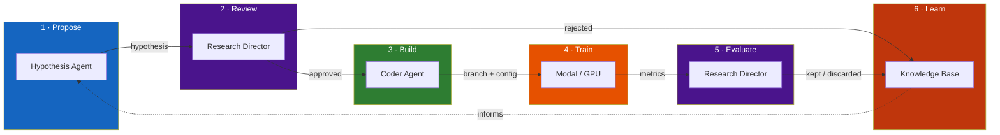
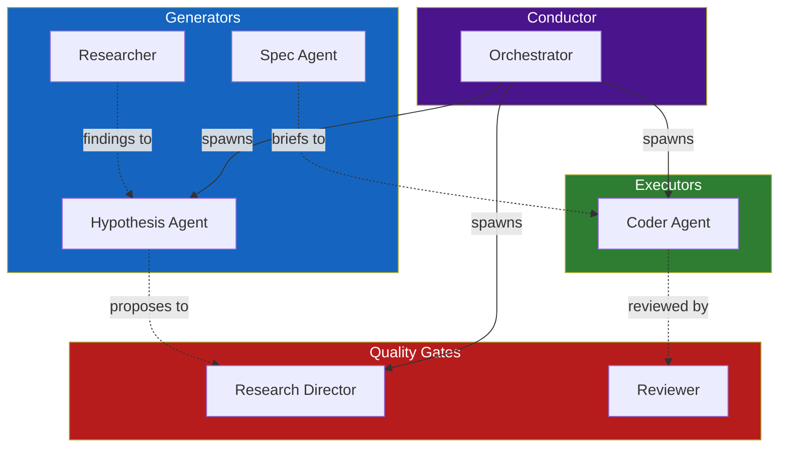
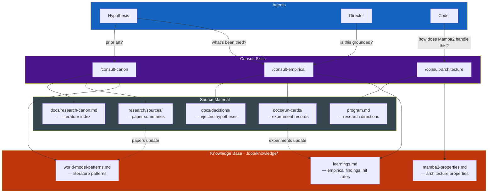
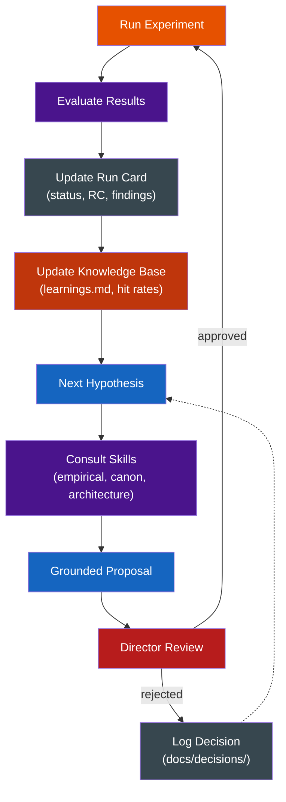

# Agent System

The autonomous research system runs experiments, evaluates results, and accumulates knowledge — without a human in the loop for each cycle. This page describes the agents, skills, and knowledge architecture that make that possible.

## The Experiment Cycle

Every experiment follows the same lifecycle. The conductor orchestrates, specialized agents handle each phase, and knowledge flows back into the system for the next cycle.

The conductor (`/conductor`) runs this cycle on a timer — typically every 60 minutes. Each heartbeat checks in-flight experiments, evaluates any that finished, and launches new ones if budget and slots allow.

## Agents

Each agent has a single responsibility. No agent both proposes and evaluates. This separation prevents the system from confirming its own biases.

| Agent | Role | Reads | Produces |
|-------|------|-------|----------|
| **Conductor** | Orchestrator. Runs the heartbeat, manages slots and budget, spawns other agents. | State files, budget, in-flight experiments | Decisions, Matrix notifications |
| **Hypothesis Agent** | Proposes one experiment per cycle. Grounds proposals in evidence and literature. | program.md, run cards, decisions, papers | Structured hypothesis + draft run card |
| **Research Director** | Quality gate. Approves/rejects hypotheses, evaluates completed experiments. | program.md, run cards, budget, metrics | APPROVE/REJECT with reasoning, KEPT/DISCARDED verdicts |
| **Coder** | Implements approved experiments. Works in isolated git worktrees. | Approved hypothesis, base config, model code | Experiment branch, config YAML, run card |
| **Researcher** | Investigates issues. Reads docs, explores code, writes findings. Never modifies code. | Anything in the repo or on the web | Findings in `.loop/knowledge/` |
| **Reviewer** | Code review on completed work. Checks quality, scope, correctness. | Branch diffs, completion criteria | APPROVE / REQUEST CHANGES verdict |
| **Spec Agent** | Helps scope work into structured briefs that coders can execute autonomously. | Human intent, project context | Briefs with tasks and completion criteria |

## Knowledge Architecture

Knowledge lives in three layers. Agents don't carry all knowledge in context — they call **consult skills** to access domain expertise on demand.

### Consult Skills

Skills are active capabilities, not passive documents. An agent invokes a skill with a question and gets a grounded answer — the skill loads its knowledge base, reads current state, and reasons about the specific question.

| Skill | When to Call | What It Knows |
|-------|-------------|---------------|
| `/consult-empirical` | Proposing an experiment and need to check if it's been tried. Evaluating results against prior findings. | Run cards, decisions, learnings. Hit rates and evidence density. |
| `/consult-canon` | Evaluating prior art. Seeking techniques from adjacent paradigms. Checking if an approach has been studied. | Research canon, paper summaries, world model patterns. |
| `/consult-architecture` | Experiment touches model structure, training regime, or loss design. Need to understand Mamba2 constraints. | Mamba2 properties, model code, training code, VRAM estimates. |

### Knowledge Base

The knowledge base (`.loop/knowledge/`) is the system's institutional memory — distilled findings that persist across sessions. It is **not** a raw dump. Each file is curated to be context-sized (2-3 pages) and actionable for experiment design.

| File | Contents | Updated By |
|------|----------|------------|
| `learnings.md` | Empirical findings with hit rates and experiment citations | Director (after evaluating results) |
| `mamba2-properties.md` | Architecture properties that matter for experiment design | Manual curation + researcher findings |
| `world-model-patterns.md` | Literature patterns mapped to our project | Research loop + manual curation |

### Practices Across All Skills

These principles apply to every consult skill:

- **Flag uncited assumptions.** If a claim has no experiment ID or paper reference, it may come from the LLM's training data. Name it: "This claim has no citation. Verify before building on it."
- **Surface divergences.** We use an SSM (not transformer), predict structured state (not pixels), train on replays (not video). Name where we diverge from the mainstream and whether it matters.
- **Track paradigm shifts.** Situate our work in the evolution of the field, not just the current snapshot.
- **Push knowledge forward.** Surface tensions and open questions. The goal is collective understanding, not confirmation.

## The Learning Loop

The system's value isn't any single experiment — it's the accumulation of knowledge over many cycles. Each cycle produces findings that change what the next cycle proposes.

**What makes this a loop, not a pipeline:**

- **Rejected hypotheses are knowledge too.** They're logged in `docs/decisions/` with full Director reasoning. Future hypothesis agents read these — they know what was considered and why it was turned down.
- **Knowledge compounds.** The empirical findings table grows with each experiment. Hit rates become more reliable. Open axes narrow or expand based on results.
- **The system can surprise itself.** An experiment proposed for one reason might reveal something unexpected. The Director captures this in the evaluation, and it enters the knowledge base as a new finding.
- **Humans stay in the loop on direction.** `program.md` is the human's lever. The system proposes and tests within the bounds that `program.md` sets. Changing `program.md` redirects the entire research frontier.

## State and Budget

The conductor tracks operational state to prevent runaway spending and manage concurrency.

| File | Purpose |
|------|---------|
| `.loop/state/budget.json` | Daily/weekly spend limits and tracking |
| `.loop/state/running.json` | In-flight experiments (up to 3 concurrent) |
| `.loop/state/log.jsonl` | Append-only decision log |
| `.loop/state/signals/pause.json` | Pause signal — stops all new launches |
| `.loop/state/signals/escalate.json` | Escalation — surfaces to human for decision |
