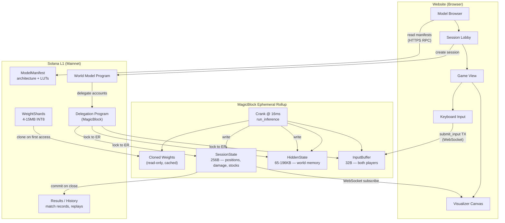
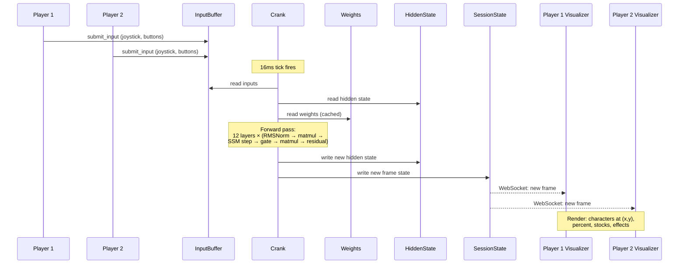
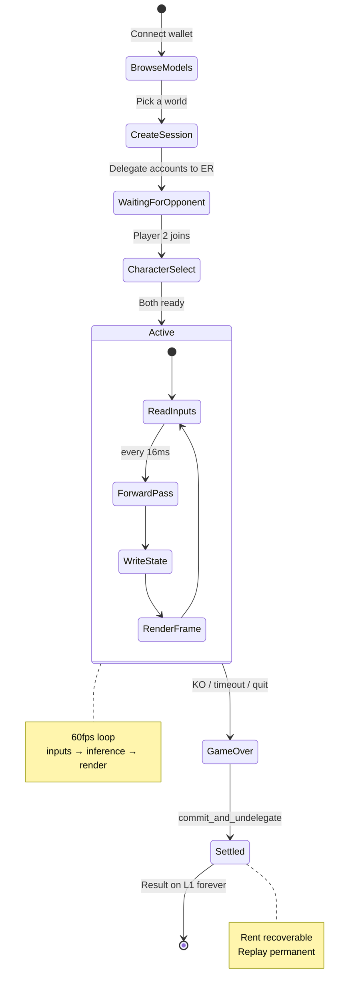
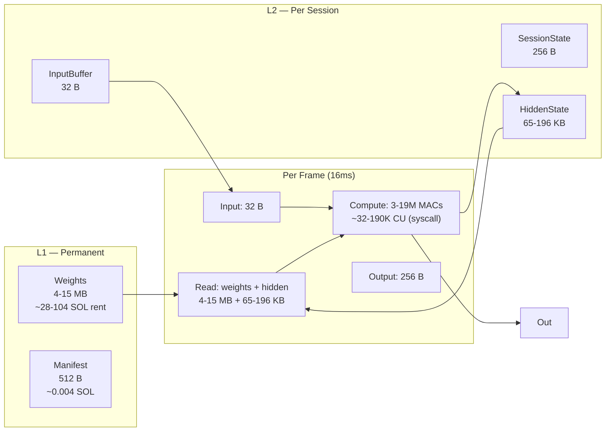
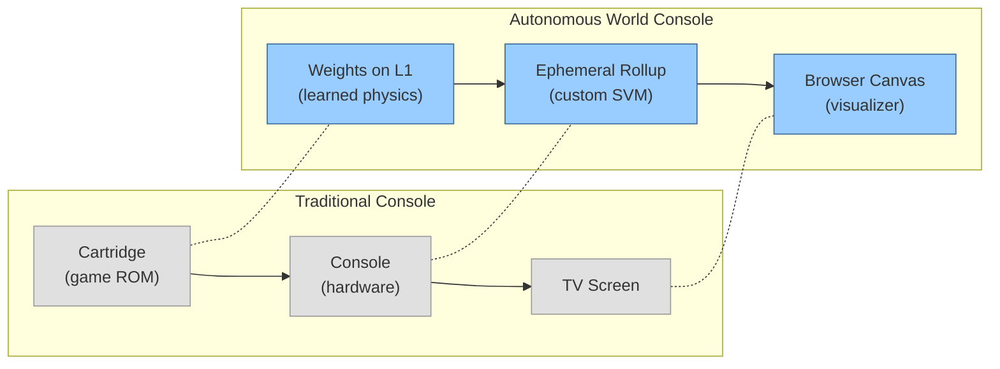

# Architecture Diagrams (Mermaid)

## System Overview

```mermaid
graph TB
    subgraph Website["Website (Browser)"]
        MB[Model Browser] --> SL[Session Lobby] --> GV[Game View]
        GV --> VIZ[Visualizer Canvas]
        GV --> KB[Keyboard Input]
    end

    subgraph L1["Solana L1 (Mainnet)"]
        WS["WeightShards<br/>4-15MB INT8"]
        MM["ModelManifest<br/>architecture + LUTs"]
        DP["Delegation Program<br/>(MagicBlock)"]
        RH["Results / History<br/>match records, replays"]
        WMP["World Model Program"]
    end

    subgraph L2["MagicBlock Ephemeral Rollup"]
        CW["Cloned Weights<br/>(read-only, cached)"]
        SS["SessionState<br/>256B — positions, damage, stocks"]
        HS["HiddenState<br/>65-196KB — world memory"]
        IB["InputBuffer<br/>32B — both players"]
        CRANK["Crank @ 16ms<br/>run_inference"]
    end

    MB -- "read manifests<br/>(HTTPS RPC)" --> MM
    SL -- "create session" --> WMP
    WMP -- "delegate accounts" --> DP
    DP -- "lock to ER" --> SS
    DP -- "lock to ER" --> HS
    DP -- "lock to ER" --> IB
    WS -- "clone on first access" --> CW
    KB -- "submit_input TX<br/>(WebSocket)" --> IB
    CRANK --> IB
    CRANK --> HS
    CRANK --> CW
    CRANK -- "write" --> SS
    CRANK -- "write" --> HS
    SS -- "WebSocket subscribe" --> VIZ
    SS -- "commit on close" --> RH
```

## Frame Loop (One Tick)

```mermaid
sequenceDiagram
    participant P1 as Player 1
    participant P2 as Player 2
    participant IB as InputBuffer
    participant CR as Crank
    participant W as Weights
    participant H as HiddenState
    participant SS as SessionState
    participant V1 as Player 1 Visualizer
    participant V2 as Player 2 Visualizer

    P1->>IB: submit_input (joystick, buttons)
    P2->>IB: submit_input (joystick, buttons)

    Note over CR: 16ms tick fires

    CR->>IB: read inputs
    CR->>H: read hidden state
    CR->>W: read weights (cached)

    Note over CR: Forward pass:<br/>12 layers × (RMSNorm → matmul →<br/>SSM step → gate → matmul → residual)

    CR->>H: write new hidden state
    CR->>SS: write new frame state

    SS-->>V1: WebSocket: new frame
    SS-->>V2: WebSocket: new frame

    Note over V1,V2: Render: characters at (x,y),<br/>percent, stocks, effects
```

## Match Lifecycle

```mermaid
stateDiagram-v2
    [*] --> BrowseModels: Connect wallet

    BrowseModels --> CreateSession: Pick a world
    CreateSession --> WaitingForOpponent: Delegate accounts to ER
    WaitingForOpponent --> CharacterSelect: Player 2 joins
    CharacterSelect --> Active: Both ready

    state Active {
        [*] --> ReadInputs
        ReadInputs --> ForwardPass: every 16ms
        ForwardPass --> WriteState
        WriteState --> RenderFrame
        RenderFrame --> ReadInputs
    }

    Active --> GameOver: KO / timeout / quit
    GameOver --> Settled: commit_and_undelegate
    Settled --> [*]: Result on L1 forever

    note right of Active
        60fps loop
        inputs → inference → render
    end note

    note right of Settled
        Rent recoverable
        Replay permanent
    end note
```

## Data Sizes

```mermaid
graph LR
    subgraph Permanent["L1 — Permanent"]
        W["Weights<br/>4-15 MB<br/>~28-104 SOL rent"]
        M["Manifest<br/>512 B<br/>~0.004 SOL"]
    end

    subgraph PerSession["L2 — Per Session"]
        S["SessionState<br/>256 B"]
        H["HiddenState<br/>65-196 KB"]
        I["InputBuffer<br/>32 B"]
    end

    subgraph PerFrame["Per Frame (16ms)"]
        IN["Input: 32 B"]
        READ["Read: weights + hidden<br/>4-15 MB + 65-196 KB"]
        COMPUTE["Compute: 3-19M MACs<br/>~32-190K CU (syscall)"]
        OUT["Output: 256 B"]
    end

    W --> READ
    H --> READ
    I --> IN
    IN --> COMPUTE
    READ --> COMPUTE
    COMPUTE --> Out
    COMPUTE --> H
```

## The Console Metaphor

```mermaid
graph LR
    subgraph Traditional["Traditional Console"]
        ROM["Cartridge<br/>(game ROM)"] --> HW["Console<br/>(hardware)"] --> TV["TV Screen"]
    end

    subgraph Autonomous["Autonomous World Console"]
        WEIGHTS["Weights on L1<br/>(learned physics)"] --> ER["Ephemeral Rollup<br/>(custom SVM)"] --> BROWSER["Browser Canvas<br/>(visualizer)"]
    end

    ROM -.- WEIGHTS
    HW -.- ER
    TV -.- BROWSER

    style ROM fill:#e0e0e0,stroke:#999
    style HW fill:#e0e0e0,stroke:#999
    style TV fill:#e0e0e0,stroke:#999
    style WEIGHTS fill:#9cf,stroke:#369
    style ER fill:#9cf,stroke:#369
    style BROWSER fill:#9cf,stroke:#369
```
