# Experiment Index

*30 experiments — 9 kept, 2 running, 0 proposed, 18 discarded.*

*Generated 2026-04-12 19:47 UTC*

**Best rollout coherence:** 4.798 ([e028a](../run-cards/e028a-full-stack.md))

## Experiment Tree

```mermaid
flowchart TD
    b001["b001"]
    b002["b002"]
    e018a_self_forcing(["e018a\nRC 6.26"])
    e018b_rollout_coherence_eval("e018b")
    e018b_self_forcing_n5["e018b\nRC 6.45"]
    e018c_rolling_context_window(["e018c\nRC 6.03"])
    e018d_horizon_weighted_loss["e018d\nRC 6.81"]
    e019_baseline("e019")
    e019a_context_k50["e019a\nRC 5.97"]
    e020a_sf_ratio_10["e020a\nRC 6.62"]
    e020b_sf_ratio_30["e020b\nRC 6.289"]
    e020c_sf_n4["e020c"]
    e021b_selective_bptt["e021b\nRC 6.87"]
    e022a_bs256["e022a\nRC 6.026"]
    e023a_dmodel192["e023a\nRC 6.065"]
    e023b_dmodel768(["e023b\nRC 5.775"])
    e023b_epoch2["e023b-epoch2\nRC 5.775"]
    e023c_dmodel512["e023c\nRC 6.203"]
    e023d_nlayers8["e023d\nRC 7.108"]
    e024a_full_bptt["e024a\nRC 8.980"]
    e025a_lr_warmup(["e025a\nRC 5.146"])
    e025b_loss_reweight["e025b\nRC 5.907"]
    e025c_layer_dropout["e025c\nRC 6.475"]
    e026a_muon["e026a\nRC 5.342"]
    e026b_unimix(["e026b\nRC 5.120"])
    e026c_sf_curriculum(["e026c\nRC 4.965"])
    e027b_e023b_regime_switch["e027b\nRC 5.225"]
    e027c_lossreweight_warmstart(["e027c\nRC 4.939"])
    e028a_full_stack(["e028a\nRC 4.798"])
    e030a_jepa_baseline["e030a"]
    e030b_jepa_rescale["e030b"]
    e031a_speed_profile(["e031a"])
    e019_baseline --> e018a_self_forcing
    e017a --> e018b_rollout_coherence_eval
    e018a_self_forcing --> e018b_self_forcing_n5
    e018a_self_forcing --> e018c_rolling_context_window
    e018a_self_forcing --> e018d_horizon_weighted_loss
    b001 --> e019_baseline
    e018c_rolling_context_window --> e019a_context_k50
    e018c_rolling_context_window --> e020a_sf_ratio_10
    e018c_rolling_context_window --> e020b_sf_ratio_30
    e018c_rolling_context_window --> e020c_sf_n4
    e018c_rolling_context_window --> e021b_selective_bptt
    e018c_rolling_context_window --> e022a_bs256
    e018c_rolling_context_window --> e023a_dmodel192
    e018c_rolling_context_window --> e023b_dmodel768
    e023b_dmodel768 --> e023b_epoch2
    e023b_dmodel768 --> e023c_dmodel512
    e023b_dmodel768 --> e023d_nlayers8
    e023b_dmodel768 --> e024a_full_bptt
    e023b_dmodel768 --> e025a_lr_warmup
    e023b_dmodel768 --> e025b_loss_reweight
    e023b_dmodel768 --> e025c_layer_dropout
    b002 --> e026a_muon
    b002 --> e026b_unimix
    b002 --> e026c_sf_curriculum
    e026c_sf_curriculum --> e027b_e023b_regime_switch
    e025b_loss_reweight --> e027c_lossreweight_warmstart
    e026c_sf_curriculum --> e027c_lossreweight_warmstart
    e026b_unimix --> e028a_full_stack
    e026c_sf_curriculum --> e028a_full_stack
    e030a_jepa_baseline --> e030b_jepa_rescale
    e028a_full_stack --> e031a_speed_profile
    style e018a_self_forcing fill:#2e7d32,color:#fff
    style e018b_rollout_coherence_eval fill:#1565c0,color:#fff
    style e018b_self_forcing_n5 fill:#616161,color:#fff
    style e018c_rolling_context_window fill:#2e7d32,color:#fff
    style e018d_horizon_weighted_loss fill:#616161,color:#fff
    style e019_baseline fill:#1565c0,color:#fff
    style e019a_context_k50 fill:#616161,color:#fff
    style e020a_sf_ratio_10 fill:#616161,color:#fff
    style e020b_sf_ratio_30 fill:#616161,color:#fff
    style e020c_sf_n4 fill:#424242,color:#999
    style e021b_selective_bptt fill:#616161,color:#fff
    style e022a_bs256 fill:#616161,color:#fff
    style e023a_dmodel192 fill:#616161,color:#fff
    style e023b_dmodel768 fill:#2e7d32,color:#fff
    style e023b_epoch2 fill:#616161,color:#fff
    style e023c_dmodel512 fill:#616161,color:#fff
    style e023d_nlayers8 fill:#616161,color:#fff
    style e024a_full_bptt fill:#616161,color:#fff
    style e025a_lr_warmup fill:#2e7d32,color:#fff
    style e025b_loss_reweight fill:#616161,color:#fff
    style e025c_layer_dropout fill:#616161,color:#fff
    style e026a_muon fill:#616161,color:#fff
    style e026b_unimix fill:#2e7d32,color:#fff
    style e026c_sf_curriculum fill:#2e7d32,color:#fff
    style e027b_e023b_regime_switch fill:#616161,color:#fff
    style e027c_lossreweight_warmstart fill:#2e7d32,color:#fff
    style e028a_full_stack fill:#2e7d32,color:#fff
    style e030a_jepa_baseline fill:#616161,color:#fff
    style e030b_jepa_rescale fill:#616161,color:#fff
    style e031a_speed_profile fill:#2e7d32,color:#fff
    style b001 fill:#4a148c,color:#fff
    style b002 fill:#4a148c,color:#fff
```

## Rollout Coherence

*Lower is better. Mean position MAE over K=20 autoregressive horizons.*

| Rank | Experiment | RC | Status | Delta vs Best |
|------|-----------|-----|--------|---------------|
| 1 | [e028a](../run-cards/e028a-full-stack.md) | 4.798 | :white_check_mark: kept | **best** |
| 2 | [e027c](../run-cards/e027c-lossreweight-warmstart.md) | 4.939 | :white_check_mark: kept | +0.14 |
| 3 | [e026c](../run-cards/e026c-sf-curriculum.md) | 4.965 | :white_check_mark: kept | +0.17 |
| 4 | [e026b](../run-cards/e026b-unimix.md) | 5.12 | :white_check_mark: kept | +0.32 |
| 5 | [e025a](../run-cards/e025a-lr-warmup.md) | 5.146 | :white_check_mark: kept | +0.35 |
| 6 | [e027b](../run-cards/e027b-e023b-regime-switch.md) | 5.225 | :x: discarded | +0.43 |
| 7 | [e026a](../run-cards/e026a-muon.md) | 5.342 | :x: discarded | +0.54 |
| 8 | [e023b](../run-cards/e023b-dmodel768.md) | 5.775 | :white_check_mark: kept | +0.98 |
| 9 | [e023b-epoch2](../run-cards/e023b-epoch2.md) | 5.775 | :x: discarded | +0.98 |
| 10 | [e025b](../run-cards/e025b-loss-reweight.md) | 5.907 | :x: discarded | +1.11 |
| 11 | [e019a](../run-cards/e019a-context-k50.md) | 5.97 | :x: discarded | +1.17 |
| 12 | [e022a](../run-cards/e022a-bs256.md) | 6.026 | :x: discarded | +1.23 |
| 13 | [e018c](../run-cards/e018c-rolling-context-window.md) | 6.03 | :white_check_mark: kept | +1.23 |
| 14 | [e023a](../run-cards/e023a-dmodel192.md) | 6.065 | :x: discarded | +1.27 |
| 15 | [e023c](../run-cards/e023c-dmodel512.md) | 6.203 | :x: discarded | +1.41 |
| 16 | [e018a](../run-cards/e018a-self-forcing.md) | 6.26 | :white_check_mark: kept | +1.46 |
| 17 | [e020b](../run-cards/e020b-sf-ratio-30.md) | 6.289 | :x: discarded | +1.49 |
| 18 | [e018b](../run-cards/e018b-self-forcing-n5.md) | 6.45 | :x: discarded | +1.65 |
| 19 | [e025c](../run-cards/e025c-layer-dropout.md) | 6.475 | :x: discarded | +1.68 |
| 20 | [e020a](../run-cards/e020a-sf-ratio-10.md) | 6.62 | :x: discarded | +1.82 |
| 21 | [e018d](../run-cards/e018d-horizon-weighted-loss.md) | 6.81 | :x: discarded | +2.01 |
| 22 | [e021b](../run-cards/e021b-selective-bptt.md) | 6.87 | :x: discarded | +2.07 |
| 23 | [e023d](../run-cards/e023d-nlayers8.md) | 7.108 | :x: discarded | +2.31 |
| 24 | [e024a](../run-cards/e024a-full-bptt.md) | 8.98 | :x: discarded | +4.18 |

## Running

| ID | Type | Base | RC | Built On | Paper |
|-----|------|------|----|----------|-------|
| [e018b](../run-cards/e018b-rollout-coherence-eval.md) | training-regime | b001 | — | e017a | — |
| [e019](../run-cards/e019-baseline.md) | training-regime | b001 | — | — | — |

## Kept

| ID | Type | Base | RC | Built On | Paper |
|-----|------|------|----|----------|-------|
| [e018a](../run-cards/e018a-self-forcing.md) | training-regime | b001 | 6.26 | e019 | [2508.13009](https://arxiv.org/abs/2508.13009) |
| [e018c](../run-cards/e018c-rolling-context-window.md) | architectural | b001 | 6.03 | e018a | [2505.20171](https://arxiv.org/abs/2505.20171) |
| [e023b](../run-cards/e023b-dmodel768.md) | architectural | b001 | 5.775 | e018c | — |
| [e025a](../run-cards/e025a-lr-warmup.md) | training-regime | b001 | 5.146 | e023b | — |
| [e026b](../run-cards/e026b-unimix.md) | training-regime | b002 | 5.120 | — | [2301.04104](https://arxiv.org/abs/2301.04104) |
| [e026c](../run-cards/e026c-sf-curriculum.md) | training-regime | b002 | 4.965 | — | — |
| [e027c](../run-cards/e027c-lossreweight-warmstart.md) | training-regime | b002 | 4.939 | e025b, e026c | — |
| [e028a](../run-cards/e028a-full-stack.md) | training-regime | b002 | 4.798 | e026b, e026c | — |
| [e031a](../run-cards/e031a-speed-profile.md) | training-regime | b002 | — | e028a | — |

## Discarded

| ID | Type | Base | RC | Built On | Paper |
|-----|------|------|----|----------|-------|
| [e018b](../run-cards/e018b-self-forcing-n5.md) | training-regime | b001 | 6.45 | e018a | [2508.13009](https://arxiv.org/abs/2508.13009) |
| [e018d](../run-cards/e018d-horizon-weighted-loss.md) | training-regime | b001 | 6.81 | e018a | [2508.13009](https://arxiv.org/abs/2508.13009) |
| [e019a](../run-cards/e019a-context-k50.md) | architectural | b001 | 5.97 | e018c | [2505.20171](https://arxiv.org/abs/2505.20171) |
| [e020a](../run-cards/e020a-sf-ratio-10.md) | training-regime | b001 | 6.62 | e018c | [2508.13009](https://arxiv.org/abs/2508.13009) |
| [e020b](../run-cards/e020b-sf-ratio-30.md) | training-regime | b001 | 6.289 | e018c | [2508.13009](https://arxiv.org/abs/2508.13009) |
| [e021b](../run-cards/e021b-selective-bptt.md) | training-regime | b001 | 6.87 | e018c | — |
| [e022a](../run-cards/e022a-bs256.md) | hyperparameter | b001 | 6.026 | e018c | — |
| [e023a](../run-cards/e023a-dmodel192.md) | architectural | b001 | 6.065 | e018c | — |
| [e023b-epoch2](../run-cards/e023b-epoch2.md) | training-regime | b001 | 5.775 | e023b | — |
| [e023c](../run-cards/e023c-dmodel512.md) | architectural | b001 | 6.203 | e023b | — |
| [e023d](../run-cards/e023d-nlayers8.md) | architectural | b001 | 7.108 | e023b | — |
| [e024a](../run-cards/e024a-full-bptt.md) | training-regime | b001 | 8.980 | e023b | — |
| [e025b](../run-cards/e025b-loss-reweight.md) | hyperparameter | b001 | 5.907 | e023b | — |
| [e025c](../run-cards/e025c-layer-dropout.md) | training-regime | b001 | 6.475 | e023b | — |
| [e026a](../run-cards/e026a-muon.md) | training-regime | b002 | 5.342 | — | — |
| [e027b](../run-cards/e027b-e023b-regime-switch.md) | training-regime | b002 | 5.225 | e026c | — |
| [e030a](../run-cards/e030a-jepa-baseline.md) | architectural | — | — | — | [2603.19312](https://arxiv.org/abs/2603.19312) |
| [e030b](../run-cards/e030b-jepa-rescale.md) | hyperparameter | — | — | e030a | [2603.19312](https://arxiv.org/abs/2603.19312) |
